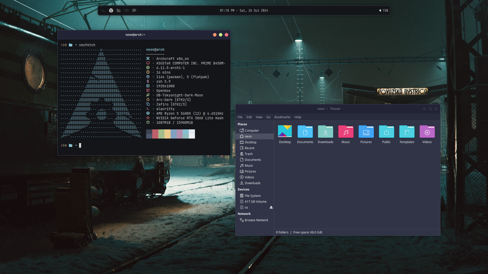

# Reborn_openbox_dotfiles
my personal openbox dotfile [archcraft]

# Reborn Openbox Dotfiles

This repository contains my custom Openbox dotfiles for use with the Archcraft Linux distribution.

## Install 
- copy Reborn folder in themes (.config -> openbox -> themes) it will show up <b>Preferences > Change Style</b>

## Theme

- Based on a gray theme.
- 

## Credits

- Special thanks to the creators of [Archcraft](https://archcraft.io/) for their incredible work in providing a beautiful and lightweight environment.
- for wallpaper [wallhaven](https://wallhaven.cc/w/e795kr)
